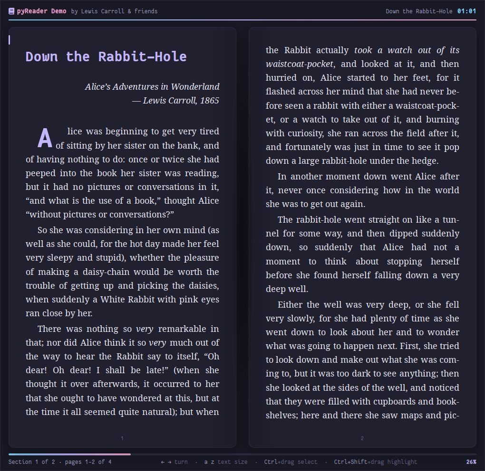
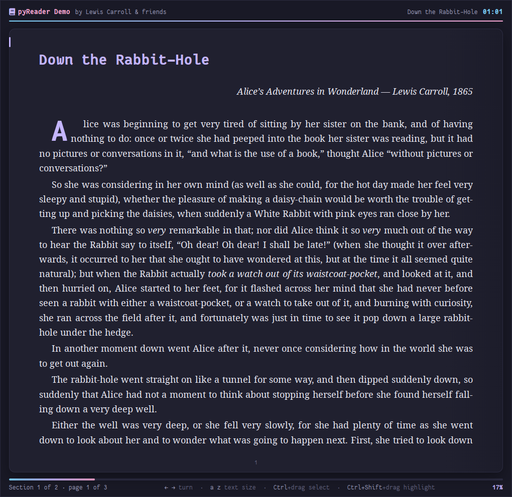
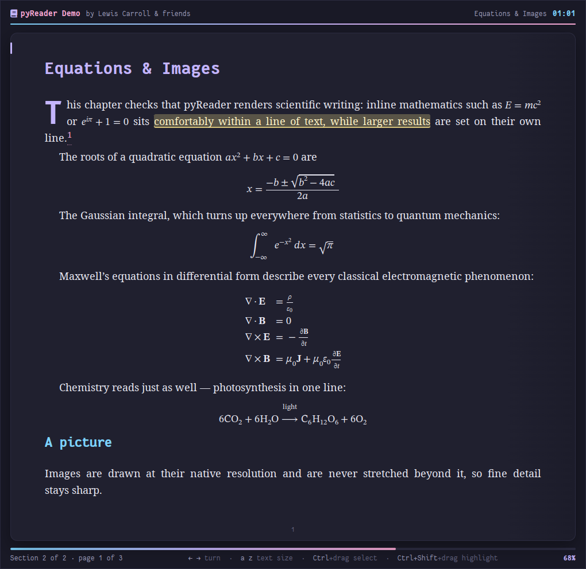
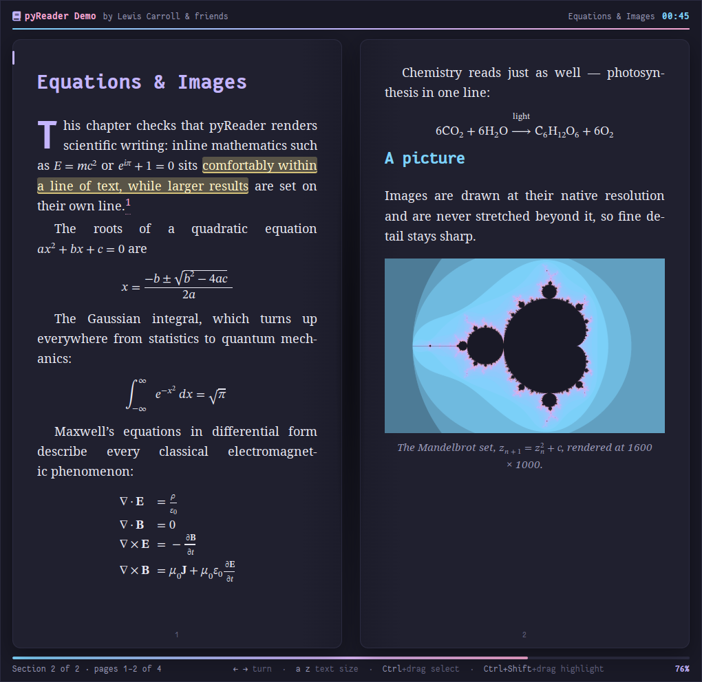
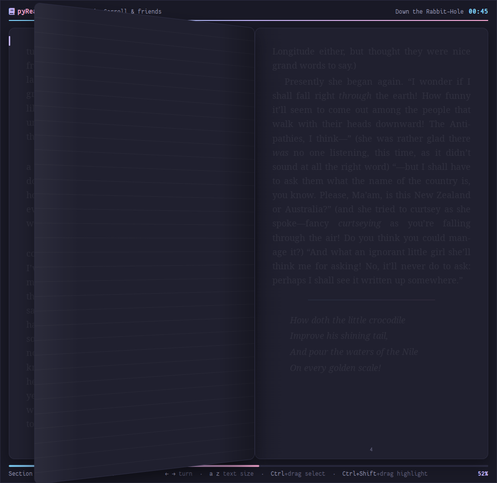
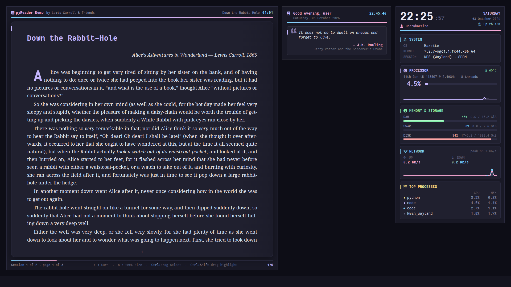
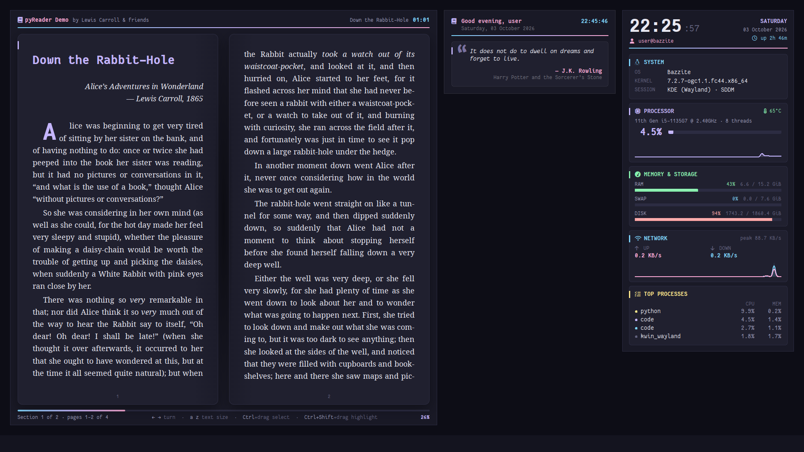

# pyReader

An EPUB reader that lives on your Linux desktop. It fills the free space beside your desktop widgets, stays *below* all other windows, and turns pages like a real book. It shares its "Midnight Ink" look with [pySysMon](https://github.com/y-v-j/pySysMon) and [pyQuotes](https://github.com/y-v-j/pyQuotes).

<p align="center">
  
</p>


-41CD52?style=flat-square&logo=qt&logoColor=white)
-191926?style=flat-square&logo=linux&logoColor=white)


## Features

- **Reads like a book:** one page across the full window or two facing pages (your choice), page numbers on each page, a progress bar, and a 3D page-turn animation driven by the arrow keys.
- **Typeset with care:** justified text with real hyphenation in the book's language (via [Pyphen](https://pyphen.org/)), a drop cap at the start of each chapter, and themed headings, quotations and rules.
- **The book's own fonts:** embedded fonts and the book's typography are honoured. Noto Serif is used only when the book doesn't choose a font.
- **Equations:** MathML is rendered natively with the bundled STIX Two Math font: fractions, roots, integrals, matrices, bold vectors, chemistry.
- **Sharp images:** pictures are shown at their native resolution and never stretched beyond it, so they never look grainy. Large images are scaled down to fit the page.
- **Select, copy and highlight:** Ctrl + drag selects text to copy. Ctrl + Shift + drag highlights it in warm amber. Highlights are saved per book.
- **Footnotes without losing your place:** click a superscript to read its note, then press Shift + ← to return to the page you were reading. It retraces several links in a row and finds the right page even if you changed the text size in between.
- **Remembers everything:** the book, the page and the text size are restored after a restart or login.
- **Instant book switching:** the book's path lives in a small config file; save it and the new book opens immediately.
- **Fits around your widgets:** it detects pySysMon and pyQuotes and fills the space to their left, and keeps below X11 bars such as [kBar](https://github.com/y-v-j/kBar) (KWin on Wayland doesn't reserve their space), re-checking every few seconds.
- **Lives on the desktop:** it stays below other windows and doesn't appear in the taskbar, pager or Alt+Tab.
- **Private:** books never touch the network. Remote resources are blocked, and nothing is cached on disk.

## Screenshots

### One page or two

Set `pages = 1` for a single page across the whole window, or `pages = 2` for two facing pages like an open book. The switch happens as soon as you save the config file.

| One page (`pages = 1`) | Two pages (`pages = 2`) |
|---|---|
|  |  |

### Equations, images and highlights

| One page | Two pages |
|---|---|
|  |  |

MathML equations drawn with STIX Two Math, a saved highlight, and a 1600 × 1000 image scaled down without loss.

### Turning the page

<p align="center">
  
</p>

### With pyQuotes and pySysMon

pyReader fills the space left of [pyQuotes](https://github.com/y-v-j/pyQuotes) and [pySysMon](https://github.com/y-v-j/pySysMon), so the three never overlap:

<p align="center">
  
  <br><em>One-page mode.</em>
</p>

<p align="center">
  
  <br><em>Two-page mode.</em>
</p>

## Requirements

| Requirement | Notes |
|---|---|
| Linux with an X11 or XWayland session | Tested on Bazzite (KDE Plasma 6, Wayland via XWayland). pyReader runs itself under XWayland so it can stay below other windows |
| Python 3.11+ | `tomllib` is used for the config |
| [PySide6](https://pypi.org/project/PySide6/) 6.7+ | Qt WebEngine (Chromium) renders the book. About 500 MB; installed by `install.sh` |
| [Pyphen](https://pypi.org/project/pyphen/) | Hyphenation. Installed by `install.sh`; optional |
| [Fantasque Sans Mono Nerd Font](https://www.nerdfonts.com/font-downloads) | Used for the reader's interface. Installed by `install.sh` |
| Noto Serif *(recommended)* | Default body font for books that don't set their own |

## Installation

### Quick install (recommended)

```bash
git clone https://github.com/y-v-j/pyReader.git
cd pyReader
./install.sh
```

Everything is installed in your home directory, so no root access is needed. The installer:

1. Installs **Fantasque Sans Mono Nerd Font** to `~/.local/share/fonts/` (skipped if it's already installed).
2. Sets up Python:
   - **conda found:** uses (or creates) the conda env **`conky-env`**, shared with pySysMon and pyQuotes, and pip-installs PySide6 and Pyphen into it.
   - **No conda:** creates a venv from a system Python 3.11+ and installs them there.
3. Copies `pyreader.py` and the `web/` folder to `~/.local/share/pyreader/` and writes a `launch.sh` launcher. The launcher uses a lock file so only one reader runs at a time.
4. Registers pyReader to start at login (see [Start at login](#start-at-login)) and launches it. Then [choose a book](#choosing-a-book-and-the-page-layout).

#### Installer options

```text
./install.sh [--startup autostart|systemd|none] [--python PATH] [--no-start] [--uninstall]

  --startup MODE   How to launch at login: autostart (default), systemd, none
  --python PATH    Use a specific Python 3.11+ interpreter
  --no-start       Don't launch pyReader after installing
  --uninstall      Remove the app and its startup entries
```

Set `PYREADER_CONDA_ENV=<name>` to use a different conda env.

### Manual installation

```bash
python3 -m pip install "PySide6>=6.7" pyphen
mkdir -p ~/.local/share/pyreader
cp -r pyreader.py web ~/.local/share/pyreader/
python3 ~/.local/share/pyreader/pyreader.py
```

## Choosing a book and the page layout

Both are set in `~/.config/pyreader/pyreader.toml`, which is created on first run:

```toml
book = "~/Books/The Hobbit.epub"
pages = 1        # 1 = one page across the whole window, 2 = two facing pages, "auto" = 2 when there's room
```

**Save the file and the change applies immediately**, with no restart: a new book opens, or the page layout switches. Each book remembers its own page and highlights, so switching back and forth picks up where you left off.

To try pyReader straight away, open the demo book in this repository:

```toml
book = "~/pyReader/samples/pyreader-demo.epub"   # adjust to where you cloned the repo
```

The demo has public-domain prose (the opening of *Alice's Adventures in Wonderland*), equations, a table and a high-resolution image. Rebuild it with `python3 samples/make_demo_epub.py` (needs Pillow).

## Usage

### Keys and mouse

| Action | How |
|---|---|
| Next page | **→**, Page Down, Space, or scroll down |
| Previous page | **←**, Page Up, Backspace, or scroll up |
| Larger / smaller text | **a** / **z** (60%–240%, remembered) |
| First / last page of the chapter | Home / End |
| Select text to copy | Hold **Ctrl** and drag, then **Ctrl+C** |
| Highlight text | Hold **Ctrl+Shift** and drag |
| Remove a highlight | **Ctrl+Shift+click** on it |
| Follow a link or footnote | Click it (web links open in your browser) |
| Go back to where you clicked a link | **Shift+←** or Shift+Backspace (repeat to retrace several links) |

Click the reader once to give it keyboard focus. Plain clicks never start a selection, so you can't select text by accident while turning pages.

### Commands

| Action | Command |
|---|---|
| Start pyReader | `~/.local/share/pyreader/launch.sh` |
| Stop pyReader | `pkill -f ~/.local/share/pyreader/pyreader.py` |
| Restart the systemd service | `systemctl --user restart pyreader` |

## Configuration

All settings are in `~/.config/pyreader/pyreader.toml`. Saved changes apply immediately.

```toml
book = ""                 # path to the EPUB (~ allowed)
pages = "auto"            # 1 = one full-width page, 2 = two facing pages, "auto" = 2 when there's room
body_font = "Noto Serif"  # used when the book doesn't choose a font
animations = true         # page-turn animation
justify = true            # justified text (false = ragged right)
hyphenate = true          # hyphenation in the book's language
avoid_windows = ["pySysMon", "pyQuotes"]  # fill the space to the left of these windows
reserve_right = 876       # space kept free on the right when none of them are running
margin = 24               # distance from the screen edges
gap = 16                  # distance from the widgets
opacity = 0.97            # window opacity
```

Not using pySysMon or pyQuotes? Set `reserve_right = 24` and pyReader fills the whole screen width.

### Where things are stored

| What | Where |
|---|---|
| Settings | `~/.config/pyreader/pyreader.toml` |
| Page, text size and highlights for each book | `~/.local/state/pyreader/state.json` |

Highlights are stored as positions within each chapter, together with the highlighted text.

## Start at login

The installer sets this up for you. Choose one method; the installer switches cleanly between them.

### Option A: XDG autostart (default; KDE Plasma, GNOME and others)

```bash
./install.sh --startup autostart
```

This installs [`pyreader.desktop`](pyreader.desktop) to `~/.config/autostart/`. On KDE Plasma you can also manage it in **System Settings → Autostart**.

### Option B: systemd user service

```bash
./install.sh --startup systemd
```

This installs [`pyreader.service`](pyreader.service), which starts with your graphical session and restarts pyReader if it crashes. Check it with `systemctl --user status pyreader`.

### Disable startup

```bash
./install.sh --startup none
```

> pyReader starts once you log in, because it needs your desktop session. If you want it on screen right after boot, enable automatic login for your display manager.

## Uninstall

```bash
./install.sh --uninstall
```

This removes the app, launcher and startup entries. Your settings, reading positions and highlights, the font and the conda env are kept.

## Troubleshooting

**The book shows an error instead of opening.**
Check the path in `~/.config/pyreader/pyreader.toml`. pyReader shows the exact problem: a missing file, a DRM-protected book, or a damaged EPUB. DRM-protected books can't be opened.

**pyReader doesn't start at login.**
Run `systemctl --user status app-pyreader@autostart.service`. If the log shows `$HOME/.local/share/pyreader/launch.sh: No such file or directory`, your autostart entry comes from an older release whose `Exec=` line used `$HOME`. KDE Plasma and GNOME run autostart entries through systemd, which escapes the `$`, so the path is never expanded. Re-run `./install.sh`, or copy the current `pyreader.desktop` to `~/.config/autostart/`.

**pyReader covers other windows.**
It asks the window manager to keep it below other windows (`_NET_WM_STATE_BELOW`). This works on KWin and most EWMH-compliant window managers. pyReader always runs through XWayland for this reason.

**Keys don't turn the page.**
Click the reader once so it has keyboard focus.

**Equations look plain or symbols are missing.**
The book may use images or LaTeX text instead of MathML; pyReader shows those as they are. MathML is drawn with the bundled STIX Two Math font.

## Project layout

```text
pyreader.py             The application (window, EPUB parsing, config, state)
web/reader.html         Reader interface
web/reader.css          "Midnight Ink" theme
web/reader.js           Pagination, page turns, highlights, MathML fix-ups
web/fonts/              STIX Two Math (SIL Open Font License)
samples/                Demo EPUB and the script that builds it
install.sh              User-space installer / uninstaller
pyreader.desktop        XDG autostart entry
pyreader.service        systemd user service
assets/                 README screenshots
```

## Credits

- [Qt WebEngine](https://doc.qt.io/qt-6/qtwebengine-index.html) via [PySide6](https://doc.qt.io/qtforpython-6/) (LGPL).
- [Pyphen](https://pyphen.org/) for hyphenation (GPL/LGPL/MPL).
- [STIX Two Math](https://github.com/stipub/stixfonts), bundled under the SIL Open Font License ([`web/fonts/STIXTwoMath-OFL.txt`](web/fonts/STIXTwoMath-OFL.txt)).
- [Fantasque Sans Mono](https://github.com/belluzj/fantasque-sans) by Jany Belluz, and its [Nerd Fonts](https://www.nerdfonts.com/) build (SIL Open Font License).
- Demo text: *Alice's Adventures in Wonderland* by Lewis Carroll (1865), in the public domain.

## License

[MIT](LICENSE) © 2026 Yogesh
